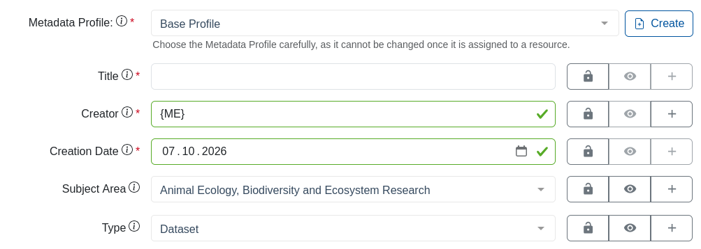

:::::::::::::::::::::::::::::::::::::: questions 

- Was ist Coscine?

::::::::::::::::::::::::::::::::::::::::::::::::

::::::::::::::::::::::::::::::::::::: objectives

- Erkläre den Zweck von Coscine
- Beschreibe die Struktur, in der Daten in Coscine gespeichert werden

::::::::::::::::::::::::::::::::::::::::::::::::

## Was ist Coscine?

Coscine ist eine Forschungsdatenmanagement-Plattform, die es ermöglicht, Daten im Sinne der FAIR Prinzipien (**F**indable, **A**ccessible, **I**nteroperable & **R**eusable) kostenlos für bis zu 10 Jahre nach Projektende zu speichern.
Coscine greift auf den DataStorage.nrw zu - ein sehr sicherer Speicher, der an den vier Standorten Aachen, Duisburg-Essen, Köln und Paderborn betrieben wird.
Seit 2018 wird Coscine an der RWTH Aachen entwickelt. 

**Die wichtigsten Funktionen**

 - Daten speichern: Pro Projekt können bis zu 125 TB Speicherplatz beantragt werden. 100 GB pro Projekt können Sie ohne einen Antrag nutzen.
 - Daten beschreiben: Alle Daten müssen mit Metadaten (Informationen über die Daten) beschrieben werden, damit sie nachvollziehbar bleiben.
 - (Meta-)Daten teilen: Metadaten können öffentlich sichtbar (innerhalb von Coscine) eingestellt werden. Die Daten selbst sind nicht frei zugänglich, können jedoch für ausgewählte Personen (z.B. Projektpartner:innen) zugänglich gemacht werden. Alle anderen können eine Anfrage per E-Mail versenden.

**Die Struktur**

 - (Sub-)Projekte: Es können beliebig viele (Sub-)Projekte erstellt werden. Sie helfen dabei, den Überblick zu behalten. Vergleichen können Sie das mit der Ordnerstruktur auf Ihrem Computer. 
 - Ressourcen: Hier legen Sie fest, wie und wo Ihre Daten gespeichert werden. Es gibt 5 Ressourcentypen die im Kapitel "Ressourcen und Metadatenprofile" genauer beschrieben werden.
 - Metadatenprofil: Ein Metadatenprofil ist immer an eine Ressource gebunden. Es gibt den Rahmen vor, mit welchen Informationen die Daten beschrieben werden, z.B. Erhebungsdatum, Erhebungsmethode. 

Jede Ressource muss immer genau ein Metadatenprofil haben. In der folgenden Abbildung wurde das Profil zur besseren Übersicht nur für eine Resource dargestellt.
{alt="Schaubild der Datenstruktur in Coscine."}

::: spoiler

Ein Metadatenprofil legt fest welche Informationen unter welchem Namen zu einer Datei gespeichert werden. Hier Beispielhaft das "Base Profile":
{alt="Screenshot des Base Profils. Gibt die Namen 'Title', 'Creator', 'Creation Date', 'Subject Area' und 'Type' vor"}

:::