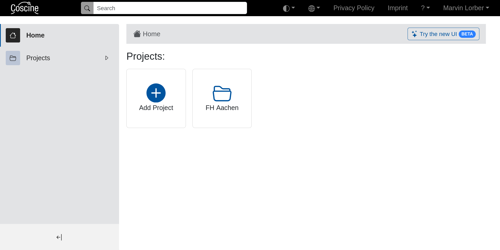

:::::::::::::::::::::::::::::::::::::: questions 

- Welche Möglichkeiten zum Login gibt es?

::::::::::::::::::::::::::::::::::::::::::::::::

::::::::::::::::::::::::::::::::::::: objectives

- Nutzen Sie die verschiedenen Methoden zum Login
- Verknüpfen Sie alle Zugänge mit dem selben Account

::::::::::::::::::::::::::::::::::::::::::::::::

## Login-Möglichkeiten

 - Per Login (All Institutions): Steht Coscine an Ihrer Hochschule zur Verfügung, können Sie sich mit Ihren Institutions-Anmeldedaten anmelden. Diese verfallen nach Beschäftigungsende. Deshalb sollten Sie Ihr Konto mit einer ORCiD verknüpfen, um dauerhaft auf Ihre Projekte zugreifen zu können. 
 - Per ORCiD: Die ORCiD ist eine eindeutige, digitale Identifikation für Forschende. Eine ORCiD besteht aus einem 16-stelligen numerischen Code. Der Login mit der ORCiD ist jederzeit möglich.

::: prereq

Falls Sie noch nicht registriert sind, legen Sie sich mit nur wenigen Klicks eine [ORCiD](https://orcid.org/register) an.

:::

Nach dem Login landen Sie auf ihrer persönlichen Startseite:

{alt="Screenshot der Startseite nach dem Login"}

::: instructor

Nach dem Login ist ein guter Zeitpunkt auf die Teilnehmer / Fragen zu warten und um auf die Mail-Verification für neue Accounts hinzuweisen. 

:::

## Profileinstellungen

Die Profileinstellungen finden Sie unter [Ihr Name] > "Nutzendenprofil" am oberen rechten Rand.

-------------------------   ---------------------------------------------------
Persönliche Angaben         Titel, Vorname, Familienname, E-Mail, Organisation, Disziplin (vgl. Spalte „Fachkollegium“ der [DFG-Fachsystematik](https://www.dfg.de/resource/blob/172316/5863ef132d178054609f74940f6a27c9/fachsystematik-2016-2019-de-grafik-data.pdf))
Zugriffstoken erstellen     Ermöglicht den automatisierten Zugriff auf alle Projekte und Dateien über die API. Mehr dazu in der [Coscine Dokumentation](https://docs.coscine.de/de/token/).
Nutzendenpräferenzen        Einstellung der bevorzugten Sprache (deutsch oder englisch) und Benachrichtigungen
Verbundene Accounts         Verknüpfung des Kontos mit anderen Accounts (z.B. ORCiD)
-------------------------   ---------------------------------------------------

::: callout

Der erste Login mit einer Login-Möglichkeit erzeugt einen neuen Account! Zur besseren Übersicht und damit Sie weiter Zugriff auf ihre Projekte haben, auch wenn Sie eine Institution verlassen, sollten Sie alle ihre Accounts miteinander verknüpfen.

:::

::::::::::::::::::::::::::::::::::::::: challenge

**Falls Speicherplatzressourcen an Ihrer Institution verfügbar sind:** 

- Melden Sie sich bei [Coscine](https://coscine.rwth-aachen.de/login) an. Nutzen Sie den Login (All Institutions). 
- Öffnen Sie Ihr Profil und vervollständigen Sie die fehlenden Informationen.

**Falls Speicherplatzressourcen an Ihrer Institution <u>nicht</u> verfügbar sind:**

- Melden Sie sich bei [Coscine](https://coscine.rwth-aachen.de/login) mit Ihrer [ORCiD](https://orcid.org/) an. 
- Öffnen Sie Ihr Profil und vervollständigen Sie die fehlenden Informationen.

::::::::::::::::::::::::::::::::::::::::::::::::::

::::::::::::::::::::::::::::::::::::::::: keypoints

- Login ist mit institutionellem Account oder ORCiD möglich
- Verschiedene Login-Methoden erzeugen separate Accounts die verknüpft werden sollten
- Kontoeinstellungen sind unter dem eigenen Namen oben rechts zu finden 

:::::::::::::::::::::::::::::::::::::::::::::::::::